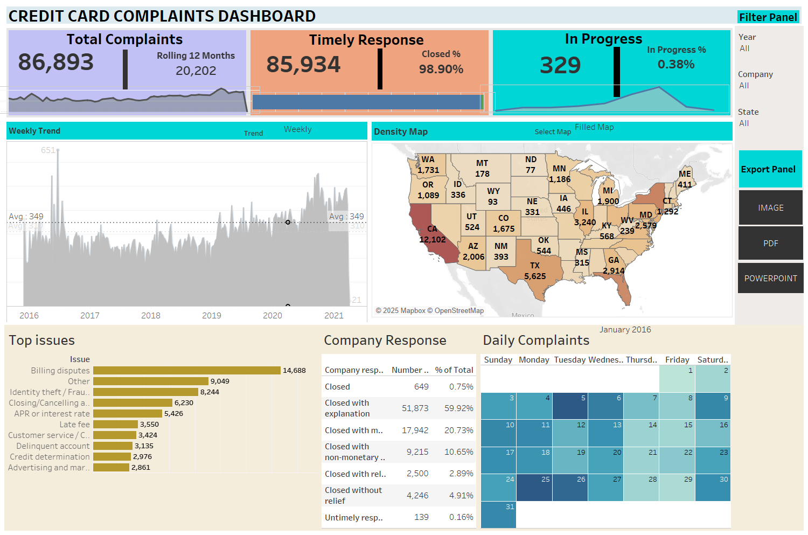

# Credit Card Complaints Dashboard

This project features an interactive Tableau dashboard that explores credit card-related customer complaints in the United States. The goal is to provide a clear overview of complaint trends, company responses, and issue types over time.

---

## Dashboard Overview

The dashboard highlights:

- **Total Complaints** over the entire dataset, along with a 12-month rolling average
- **Timely Responses** from companies, including the percentage of complaints resolved promptly
- **In-Progress Cases**, giving visibility into unresolved issues
- **Complaint Trends Over Time**, displayed weekly to show volume fluctuations
- **Geographical Breakdown** using a filled map of the U.S. to visualize complaint distribution by state
- **Top Complaint Issues**, ranked by volume
- **Company Response Types**, showing how complaints were addressed
- **Daily Complaints Heatmap**, providing insight into day-wise complaint frequency

---

## Filters Available

Users can interact with the dashboard using the following filters:
- Year
- Company
- State

These allow for focused analysis based on specific timeframes, regions, or organizations.

---

## Preview

---

## File Included

- `credit_card_complaints_dashboard.twbx`: Tableau Packaged Workbook that includes all visualizations and data

---

## Tools Used

- Tableau Desktop
- Excel (data source)
- Mapbox (for U.S. filled map)

---

## Use Case

This dashboard can be useful for:
- Analyzing service quality in the financial sector
- Understanding customer pain points
- Identifying trends across states and companies
- Supporting decision-making in customer experience teams

---

            

---

Thanks for checking it out!
